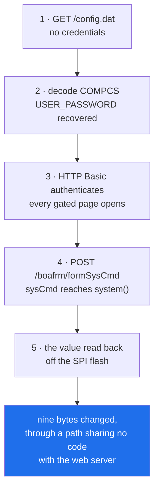
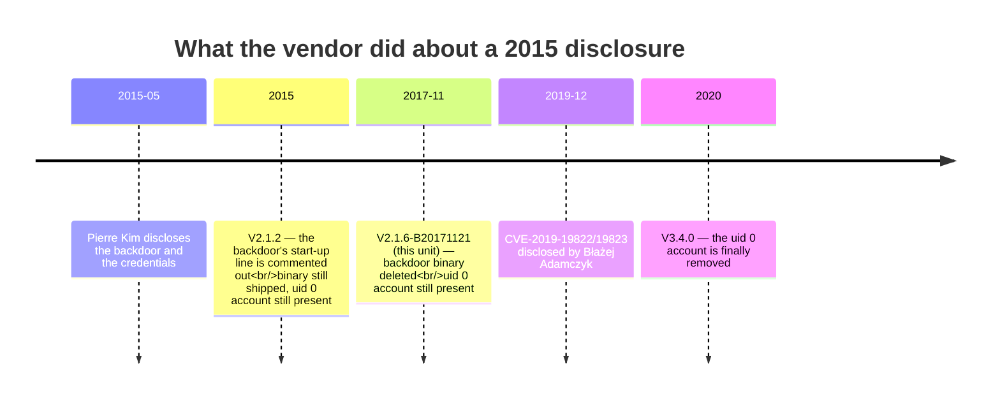

# TOTOLINK N150RT — firmware reverse engineering

[](https://github.com/Jhongwe1/router-firmware-re/actions/workflows/ci.yml)
[](LICENSE)

I bought an end-of-life consumer router, read its 4 MiB SPI flash through the
boot loader's own commands over a soldered serial console, and found it runs a
firmware that appears on no vendor download page — a 2018 build sitting in the
middle of a five-year, three-step vendor response to a 2015 disclosure.

### **[→ Read the write-up: *The Build Nobody Had*](writeup/README.md)**

---

## The 60-second version

| | |
|---|---|
| **Device** | TOTOLINK N150RT hardware V2.0 · Realtek **RTL8196E** · big-endian MIPS-I / o32 · Boa 0.94.14rc21 **running as root** · SquashFS 4.0 |
| **How far** | soldered UART → measured baud → boot loader → **4 MiB flash read off the chip** → six `boa` binaries read side by side → CVEs located at instruction level → full chain on the physical unit → fourteen-chapter write-up |
| **The one result nobody else can get** | this unit's resident build, `TOTOLINK-CX-N150RT-V2.1.6-B20171121.1002`, **is on no download page**. It is the missing middle of the vendor's fix: 2015 comments out a line, 2018 deletes the backdoor binary **but keeps the uid 0 account**, 2020 finally removes the account |
| **Tooling written for it** | a zero-dependency firmware CLI, eight headless Ghidra scripts emitting diffable JSON, a static gate, and **seven** consistency checkers pointed at this repository rather than at the router — **638 checks**, of which **508 exist to prove a tool can refuse** |
| **Instruments of mine that were wrong** | **sixty-one**, all listed. **Not one was caught by the instrument's own self-check** |

<p align="center">
  
</p>

---

## Six results, each with the artefact it was measured on

Every row names the binary or the device it came from. That rule is the subject
of [chapter 1](writeup/01-rules.md) and it is enforced by CI: a Ghidra report
that does not carry the SHA-256 of its input fails the build.

| | result | where the evidence is |
|---|---|---|
| **1** | **A build that is not published anywhere.** Read off this unit's own flash; its version string is public, this build is not. It places the vendor's response to a 2015 disclosure at three steps across five years | [writeup ch.5](writeup/05-the-build.md) · [`notes/dump-vs-official.md`](notes/dump-vs-official.md) |
| **2** | **An unauthenticated HTTP POST changed nine named bytes of SPI flash** — and they land in `H601`, the region holding this unit's MAC addresses and radio calibration, which a factory reset does not restore | [writeup ch.10](writeup/10-chain.md) · [`poc/03-flash-evidence.md`](poc/03-flash-evidence.md) |
| **3** | **CVE-2024-51228's CVSS vector is wrong.** NVD scores it `PR:H`; a POST carrying no `Authorization` header executed the command, and the same request *with* valid credentials behaved identically. `PR:N` puts it at **8.8 HIGH**, not 6.8 MEDIUM | [`notes/cve-status.md`](notes/cve-status.md) · [`poc/02-command-injection.md`](poc/02-command-injection.md) |
| **4** | **An uninitialised credential pair** on the stack: an empty user name and password compare successfully and skip the authorisation block outright. Present in 2015, present in 2018, gone in 2020 | [`notes/uninit-credential-pair.md`](notes/uninit-credential-pair.md) |
| **5** | **156 bytes of my own position-independent MIPS-I code ran on this SoC** — UART register address disassembled out of the loader's own `putchar`, every word verified by a simulator before it was written, run twice at different load addresses to prove it was really PIC. The first run printed 16 bytes of a 41-byte banner, which is a **load delay slot** and the story is better than the payload | [writeup ch.12](writeup/12-instruments.md) · [`tools/mkramboot.py`](tools/mkramboot.py) |
| **6** | **A static gate that the vendor's 2020 build still fails.** Request-parameter data reaching an unbounded sink — validated against a build known to contain the defect, because a rule that never fires never fails | [writeup ch.13](writeup/13-gate.md) · [`ghidra/scripts/BoaGate.java`](ghidra/scripts/BoaGate.java) |

---

## The chain, end to end

Five links, and the last one is the point: command execution is proven by
reading the byte it changed in SPI flash, through a path that shares no code
with the web server — not by an HTTP response.



And the thing the flash read is actually for — a five-year fix, caught in the
middle because the middle is the build this unit runs:



---

## What this project is actually about

Not the bugs. Most of them were public before I started. The method:

- **Predictions are frozen before the packet.** 141 registered tests, 127
  carrying a written statement of *what result would prove me wrong*, hashed and
  committed before the first request. Editing a prediction after a result shows
  up in `git diff`, and [`tools/rtcase.py`](tools/rtcase.py) refuses a result
  whose refutation field is empty.
- **A tool has to be shown refusing.** 508 of the 638 checks exist only to feed
  an instrument bad input and require it to reject it — because a check that has
  never been seen to fail is indistinguishable from no check.
- **Sixty-one of my own instruments were wrong, and all of them are published**
  ([chapter 12](writeup/12-instruments.md)). Not one was caught by the
  instrument's own self-check. That chapter costs the most and is worth the most.
- **What was *not* proved gets its own chapter**
  ([chapter 14](writeup/14-limits.md)). Example: this unit's flash has been read
  by exactly one kind of instrument, because the SOIC-8 clip measured 1.70 V on
  a 3.3 V part — so *"Eon EN25QH32B"* still rests on one source, the marking on
  the package.

---

## Where to start

| if you want | read | time |
|---|---|---|
| the story | [`writeup/`](writeup/) — or just chapters [5](writeup/05-the-build.md), [10](writeup/10-chain.md) and [12](writeup/12-instruments.md) | 15 min |
| to check it yourself | [**`REPRODUCE.md`**](REPRODUCE.md) — what a clone verifies, what needs a device, and **what nobody but me can verify, said on page one** | 30 min |
| the code | [`tools/`](tools/) · [`tools/fwrecon/`](tools/fwrecon/) · [`ghidra/scripts/`](ghidra/scripts/) | |
| the findings, one page each | [`docs/disclosure.md`](docs/disclosure.md) — nineteen rows, with what each one is *not* | |
| the standard the gates were scored against | [`docs/gates.md`](docs/gates.md) — lifted from the week plans, which were written first | |
| where I went wrong | [`journal/`](journal/) — the full working record, every dead end included (Traditional Chinese) | no limit |

## Five minutes, no hardware

```bash
bash tools/test-loader-unpack.sh
```

Thirty-four cases, no device and no downloads. It builds deliberately broken
boot-loader images and checks the unpacker refuses each one **for the right
reason**, then unpacks a good one as the positive control — because in a suite
made only of refusals, a tool that always refuses and a tool that refuses
correctly look identical.

---
<details>
<summary><b>Gate board — G0 to G5, and the week-by-week record</b> (every box carries the evidence behind it)</summary>

The gates are the acceptance criteria from the week plans, lifted verbatim into
[`docs/gates.md`](docs/gates.md). Nothing is ticked that is not backed by a
command someone else can re-run.
The gates below are the acceptance criteria from the week plans, lifted verbatim
into [`docs/gates.md`](docs/gates.md) — copied, not invented after the fact. The
first commit of `PROGRESS.md` (`b085444`, 2026-08-07, nine days before the
hardware arrived) already carries the whole G0–G5 assignment, so the standard is
datable from this repository's own history. Nothing is ticked here that is not
backed by a command someone else can re-run.

- [x] **G0 — toolchain green** (W01) ← [PROGRESS.md](journal/PROGRESS.md#g0--toolchain-green)
  - [x] binwalk + sasquatch produce a SquashFS from the vendor image
  - [x] `qemu-mips-static`, `flashrom`, `picocom` all answer when run
  - [x] Ghidra 12.1.2 on pinned Temurin JDK 21 — SHA-256 verified, no admin rights needed
  - [x] every tool checked by **running** it, not by testing for a file — `make verify`

  > 📌 The plan's G0 listed PuTTY. Dropped rather than forgotten: `picocom` does
  > the same job from inside WSL, where the rest of the toolchain already lives.
  > `usbipd-win` and FirmAE were **deferred with a written reason each**, so a
  > later session finds a decision instead of an oversight —
  > [Deliberately not done in W01](journal/PROGRESS.md#deliberately-not-done-in-w01).

- [x] **G1 — firmware anatomy, seven elements answered from measurement** (W01) ← [PROGRESS.md](journal/PROGRESS.md#g1--seven-elements-answered-from-measurement)
  - [x] firmware unpacked — SquashFS 4.0, LZMA (2015) and XZ (2020)
  - [x] all seven elements answered from the images, not from a datasheet:
        SoC · architecture · endianness · load base · filesystem · web binary · config storage
  - [x] [`notes/anatomy-n150rt.md`](notes/anatomy-n150rt.md) — how the firmware is built
  - [x] [`notes/prior-art.md`](notes/prior-art.md) — planned as `pierre-kim-map.md`,
        renamed once the attribution turned out to be wrong
  - [x] [`notes/attack-surface.md`](notes/attack-surface.md) v1 — where to look, ranked
  - [x] **beyond the plan:** two firmware versions instead of one ·
        [`fwrecon`](tools/fwrecon/), a zero-runtime-dependency analysis tool with 58 tests ·
        headless Ghidra triage emitting diffable JSON instead of a one-machine GUI session ·
        pinned [`docker/Dockerfile`](docker/Dockerfile) + CI

  > ⚠️ **Four things the plan asserted that the images contradict** — full table in
  > [Corrections to the original plan](journal/PROGRESS.md#corrections-to-the-original-plan):
  > CVE-2019-1982x are **Błażej Adamczyk's**, not Pierre Kim's ·
  > there is **no `/etc/passwd`** in either image, so the credential check lives inside a binary ·
  > `formSysCmd` **is not a string in either `boa`** ·
  > the flash map needs **≥ 3.57 MiB**, not the 2 MB the published specs claim.

#### ★ What G1 actually turned up

- **The 2015 build is the vendor's response to Pierre Kim's July 2015
  disclosure — and the response was to comment out one line.** `/etc/init.d/rcS`
  contains `#skt&`; `/bin/skt`, a socket-driven `system()` wrapper, is still
  shipped and still executable. Not starting a backdoor and not having one are
  different properties.
- **In the 2020 build — nine months after the Realtek SDK full disclosure —
  `/web/config.dat` is a symlink to `/var/config.dat`,** and `rcS` copies `/web/*`
  into the live document root. The exposure path behind CVE-2019-19822 is
  structurally intact.
- **`formSysCmd` does not appear in either binary** — but `sysCmdselect`,
  `sysCmdLog` and `/tmp/syscmd.log` do. The CVE-2019-19824 feature is compiled
  in; only its dispatch name is missing from the string table.
- **No exploit mitigations anywhere:** no canary, RELRO, PIE or FORTIFY, and no
  `PT_GNU_STACK` on most binaries — an executable stack. Boa runs as root.

> ⚠️ **Scope of these claims.** All four are **static** results, read out of
> firmware images — no running device has been touched yet. In particular,
> whether `/config.dat` is reachable *unauthenticated* depends on Boa's
> request-authorisation code — **answered in W03/W04: no authorisation runs for
> it, in either build**. The symlink proved the file is in the docroot and
> nothing more; the gate is what settled it. Which build is actually on my unit is decided
> by a flash dump, which is G2's job.

- [x] **G2 — hardware access: UART + SPI dump** (W02) ✅ **passed 2026-08-16** ← [PROGRESS.md](journal/PROGRESS.md#w02--2026-08-14--16)
  - [x] **a live bootlog** ← [`notes/uart-findings.md`](notes/uart-findings.md) —
        captured at 38400 over a measured pin-out, and independently decoded a
        second time off the same wire by a logic analyser; the two transcripts are
        byte-identical
  - [x] **SPI dump + hash verification** — **two** full 4 MiB reads, 105 minutes each,
        zero chunk retries, staged through **different RAM addresses** so a bad RAM
        region could not produce two identical wrong answers. `sha256 a800059a…` both
        times, recomputed independently of the tool that wrote them, and `cmp` finds
        zero differing bytes. 21 structural checks against expectations recorded
        before the image existed
  - [x] **dump vs vendor image compared** ← [`notes/dump-vs-official.md`](notes/dump-vs-official.md) —
        and the unit's build turns out to sit in the middle of a **five-year, three-step
        vendor remediation** that neither published image shows
  - [x] **annotated PCB photograph** ← [`notes/img/`](notes/img/) — rendered from a
        committed JSON spec, not drawn in an image editor, and the unit's MAC and
        serial are painted out with the coordinates recorded
  - [x] **settles two open questions, both carried since W01** — the real flash part
        and size (**Eon EN25QH32B, 4 MiB**, against a published 2 MB), and which build
        this unit runs (**2018-01-10 — neither analysed image**, which the Day 1
        date-code prediction called before anything was powered on)

  > 
  >
  > ### ★ What W02 Day 1 turned up
  >
  > - **The flash is 4 MiB, and W01 said so first.** Eon EN25QH32B, 32 Mbit, at
  >   `U19`. W01 derived `≥ 4 MB` from the vendor container's own burn addresses
  >   three weeks before the hardware arrived, against a published specification of
  >   2 MB. This is the first falsifiable claim the project made about the physical
  >   world, and the physical world agreed.
  > - **The SoC is an RTL8196E**, not the RTL8196C the plan asserted — a different
  >   CPU core, which bears directly on W01's reading of the ELF header as MIPS-I
  >   and turns it into a testable hypothesis about the SDK's toolchain.
  > - **The RAM is 32 MiB fitted**, not 16 MB. *Fitted* is not *usable*; the kernel
  >   banner decides the second number and both are recorded.
  > - **The UART header is already populated** — W02 requires no soldering at all,
  >   which takes the week's largest irreversible-damage risk off the table.
  > - **Every one of those readings has exactly one source: the ink on the package.**
  >   The second-source column is empty on purpose, and it is the Day 2–4 work list.
  >
  >   > **Corrected 2026-08-21.** This bullet used to add that `flashrom` agreeing
  >   > on 4096 KiB is not independent *"because its database is keyed on the same
  >   > part name"*. **That is false** — flashrom matches on `manufacture_id` and
  >   > `model_id`, and the name is the lookup's output rather than its index. Told
  >   > to emulate `W25Q128FV` it answers `W25Q128.V`: a different string comes out
  >   > than went in, which a name-keyed lookup cannot do. So flashrom's answer
  >   > **is** a second source for *which part an id denotes* — though not for
  >   > *what the id bytes are*, which is the same clip on the same bus. The same
  >   > wrong sentence stood in `RUNBOOK` §8.12.41 and in `P9-7`'s registered
  >   > prediction; the RUNBOOK is corrected, the prediction is deliberately not.
  >
  > ### ★ What W02 Day 2–3 turned up
  >
  > - **The unit runs a third firmware — built 2018-01-10 — including its own
  >   `/bin/boa`.** So the binary this project has read since W03 is not the one
  >   this device runs. W03/W04's findings still stand for the images they name;
  >   they simply do not cover this hardware, and W05/W06 against it will be testing
  >   a third binary.
  > - **W01's flash map, confirmed on silicon.** The three burn addresses it derived
  >   from the vendor containers — `w6cg` at `0x010000`, `cr6c` at `0x060000`, rootfs
  >   at `0x180000` — are exactly where this unseen build sits. Three for three, and
  >   the image needs 3.29 MiB against a published 2 MB.
  > - **`FLR` + `DB` in the boot loader is a full flash read path with no chip clip.**
  >   The plan listed that only as a bonus for the case where everything else already
  >   worked.
  > - **A W01 hedge comes off.** Its "*possibly* a build-script bug writing a size
  >   into `mkfs_time`" now holds on a third independent build.
  > - **The config blob W04 was blocked on is at `0x00C000`**, with its factory-default
  >   twin at `0x008000` — a differential pair into an undocumented format.
  > - **RTL8196E is now three sources deep**, including the boot code comparing a
  >   chip-ID register against `0x8196E000`. The Linux driver's dissenting
  >   `chip name: 8196C` loses because two lines earlier it announces it is probing an
  >   RTL8186.
  >
  > ### ★ What W02 Day 4 turned up
  >
  > - **The vendor's fix for the 2015 backdoor took three steps across five years,
  >   and the middle one exists on no download page.** 2015: comment out `#skt&`.
  >   **2018 (this unit): delete `/bin/skt` — and leave the `onlime_r` uid 0 account
  >   untouched, byte for byte, next to the dead `#skt&` line.** 2020: finally remove
  >   the account. CVE-2015-9550 and 9551 were disclosed together; two and a half
  >   years later the vendor had fixed one of them. `root:zhxPr1e7Npazg` is identical
  >   in all three.
  > - **The full 4 MiB was read through the boot loader, not a programmer.** The
  >   CH341A on the desk measured as an un-modded 5 V board — every pin it drives at
  >   5 V into a 3.3 V part — so the risk was left on a $3 board instead of on the
  >   only unit that gates G2 and G4. `FLR`+`DB`, 105 minutes, **zero chunk retries**.
  > - **The dump is checked against expectations written before it existed:** W01's
  >   burn addresses, derived from the vendor containers three weeks before the
  >   hardware arrived, and every offset the 2026-08-15 console session read. 21 hard
  >   checks, all passed — and the strongest check is not on that list, because
  >   **1.8 MiB of LZMA does not decompress by accident.**
  > - **Four more instrument bugs, none caught by a tool's own self-check** — including
  >   a parser written from a *summary* of the device's output when the verbatim
  >   transcript was in the runbook all along, and its guard suite passing 10/10
  >   against a format the device does not emit.
  > - **And five more on 2026-08-18, one of which reached outside the tooling
  >   entirely**: guests ran in a `chroot` as root with no namespace, so a
  >   firmware handler that calls `system("reboot -f")` powered off the host —
  >   three times, each time looking like the harness hanging. Two of the other
  >   four were a closed loop: a refusal that printed a fix command its own
  >   parser rejects, and the correctly-spelled version exiting 1 in silence
  >   without killing anything.
  >
  > ⚠️ **No second instrument has read this chip, and no JEDEC ID** — true as of
  > **2026-08-20**. Both full reads and the 2026-08-15 windows all go through the
  > boot loader's `FLR`, so a systematically wrong `FLR` would be invisible to
  > every one of them. That column stays empty on purpose.
  >
  > 🛑 **The instrument was used on 2026-08-21 and could not reach the part.**
  > Seating the SOIC-8 clip on `U19` takes the **CH341A itself** off the USB bus,
  > and the chip measures **1.70 V** under three different supplies — including an
  > external regulator that held a healthy 3.3 V on its own side. **In-circuit
  > reading does not work on this board.** Whether that is the board clamping the
  > `VCC` net or resistance in the clip path is **open item 97**, and the committed
  > claim is only the first half. **Nothing was read and nothing was written**; the
  > router was never powered. `BENCH-LOG.md` 2026-08-21 實錄 carries every number.
  > The column above therefore stays empty, now for a measured reason rather than
  > for want of an instrument.
  >
  > 📌 **The instrument exists and is verified** (2026-08-20). The CH341A that W02
  > measured as an un-modded 5 V board has been
  > re-worked — 5 V feed cut on the back, 3.3 V jumpered into that pin — and the
  > mod is confirmed **at two points in the circuit**: all eight socket pins read
  > 3.3 V (the effect, and `DO` was the 5 V board's worst pin, held 1.7 V above
  > its own supply), and **pin 28**, the CH341A's own I/O supply, reads 3.3 V
  > (the cause — and the measurement W02 recorded as missing). `BENCH-LOG.md`
  > `T-84`.
  >
  > **Having a verified instrument is still not having the measurement**, and
  > that distinction is what this line has been holding open since 2026-08-16.
  > `A5.1`–`A5.5` are written, every prediction is in `BENCH-LOG.md` 2026-08-20
  > §2, and nothing has been clipped.
  >
  > 🔎 What the desk *did* settle, with no clip: the boot loader carries a table of
  > 32 flash descriptors keyed on JEDEC id, and **this unit's part has no row in
  > it** — which is why `chipName: UNKNOWN` has been on line 3 of every boot log
  > since 2026-08-15. [`notes/loader-chip-table.md`](notes/loader-chip-table.md).

- [x] **G3 — point at the line in the binary** (W03–W04) ✅ **passed 2026-08-11** ← [PROGRESS.md](journal/PROGRESS.md#w04--2026-08-11)
  - [x] the `/boafrm/` dispatch table found, with ≥ 10 handlers listed — **59 in 2015, 49 in 2020**, both `root_form[]` arrays recovered with the function that reads each
  - [x] ≥ 1 authentication candidate function identified — `process_header_end`, in **both** builds: `0x0040be0c` (2015) and `0x00409fd8` (2020)
  - [x] **where `formSysCmd` is really registered** — **nowhere.** It is in neither dispatch table; and V2.1.2 ships *after* the last build Pierre Kim reports as vulnerable to CVE-2015-9551, so this reads as the vendor's fix
  - [x] **whether Boa authenticates `.dat` requests** — **no, in both builds**, and not because `.dat` is special: 2015 checks only URIs containing `htm`, 2020 checks only `.htm`, `.asp` or POST
  - [x] `FUN_00440eec` holds `cp /var/web/config.dat %s` — traced: `formSaveConfig`, a `localtime()` filename. **Not injectable**, and the buffer W03 worried about has 100 bytes for a 47-character format
  - [x] [`notes/sink-inventory.md`](notes/sink-inventory.md), and ≥ 5 functions renamed in Ghidra — **185 named** from table evidence, in the project database
  - [x] [`notes/auth-flow.md`](notes/auth-flow.md) complete for 2015 **and** [`notes/auth-flow-2020.md`](notes/auth-flow-2020.md) for 2020
  - [x] ≥ 1 of the CVE-2025 series root-caused — **twelve of the fourteen**, and they reduce to **three** defects. The series names *this* model (`N150RT 3.4.0-B20190525`), which W01 and W03 both had wrong
  - [x] **beyond the gate:** the backdoor account located — `onlime_r` / `12345`, uid 0, in the build the vendor shipped *after* the 2015 disclosure · every MIB id named from `libapmib.so` · two shipped private keys

  > ### ★ What W04 turned up
  >
  > - **Fourteen 2025 CVEs, three defects.** `sprintf(buf[100], "flash set
  >   HW_WLAN0_WSC_PIN %s", localPin); system(buf)` is a single line that is both
  >   CVE-2025-3987 (no filtering) and CVE-2025-4462 (no bound) — and it is
  >   **identical in the 2015 image**, ten years before either id existed. Four
  >   more are one `submit-url` idiom that appears in **34 handlers**; the four
  >   with ids are a sample, not a set.
  > - **`lastUrl[100]`, then `needReboot`.** The `submit-url` copy lands in a
  >   `.bss` buffer whose size comes from the symbol table, not from a guess, and
  >   the next two objects after it are control flags. Separately, omitting the
  >   parameter makes the handler `strcpy` into the `""` literal in a read-only
  >   segment — as the code reads, a one-request unauthenticated crash.
  > - **The 2020 build fixed the 2015 hole and kept the technique.** Every POST
  >   is now gated — that is a real repair. But authorisation is still decided by
  >   `strstr` over the URI, and the exemption list is unanchored.
  >   `GET /config.dat` remains outside the gate in a build dated nine months
  >   after full disclosure.
  > - **W01's "there is no `/etc/passwd`" was a false negative** — a dangling
  >   symlink read as an absent file. Both images ship the template; the 2015 one
  >   contains Pierre Kim's `onlime_r` account at uid 0, with his published hash,
  >   and `root` is `123456` in **both** builds.
  > - **Three bugs in the new tracer, none caught by its own self-check.** All
  >   three were caught by the project's own rule — read the two builds across,
  >   not down — because one codebase five years apart cannot go 86 → 0.
  >
  > ⚠️ **All of it is static**, read out of the two vendor images. W02 has since
  > powered the device on and found it runs **neither of them**, so none of this is
  > yet known to describe the hardware on the bench. The 2020 substring bypass in
  > particular is a reading of three
  > `strstr` calls that has never been executed. *(The clause that stood here —
  > "it goes to TWCERT/CC if and only if W05/W06 demonstrates it" — was retired
  > on 2026-08-23 along with the rest of the reporting policy. It is still an
  > unexecuted static reading, which is the part that mattered.)*

- [x] **G3.5 — every `boa` claim names the binary it was measured on** (W04-2) ✅ **passed 2026-08-17** ← [PROGRESS.md](journal/PROGRESS.md#w04-2--2026-08-16)
  - [x] `root_form[]` + sink census for all three builds, each carrying its input's SHA-256
  - [x] [`notes/auth-flow-2018.md`](notes/auth-flow-2018.md) — the gate on the resident build, key branch read at **instruction level** because the decompiler raised three warnings on it
  - [x] [`notes/compcs-decode.md`](notes/compcs-decode.md) — the config region decoded; `TELNET_ENABLED = 0` with a second source
  - [x] G4's target chosen from evidence: `POST /boafrm/formSysCmd`
  - [x] **the `FLW` recovery path rehearsed** — executed 2026-08-17: write, read
        back **to a different RAM address**, erase, verify. Verbatim transcript in
        [`RUNBOOK.md` §8.9.1](journal/RUNBOOK.md), and the drill overturned four things
        the runbook asserted about it

  > ### ★ What W04-2 turned up
  >
  > - **`formSysCmd` is in this unit's dispatch table and in neither published
  >   image.** `grep -aoc` on the three raw binaries: **0 / 1 / 0**. Absent →
  >   present → absent is a build-time option, not a vendor fix, and **W04's
  >   G3 box 1 is overturned.** CVE-2019-19824 lists "N150RT through 3.4.0" as
  >   affected; both images anyone can download happen to be ones without it, so
  >   reproducing that CVE from published firmware gives the wrong answer about
  >   this hardware.
  > - **The gate is a third answer.** 2015 checks `strstr(uri,"htm")`; 2020 adds
  >   POST; **2018 checks `.htm` or `.asp` and nothing else** — 2015's outcome by
  >   2020's mechanism, decided by 13 unanchored `strstr` calls on one string.
  > - **The config region is decoded.** LZSS over a TLV table, confirmed twice —
  >   inferred from the data, then read out of `libapmib.so`'s `Decode`, which
  >   also supplied a checksum invisible in the data that both regions pass.
  >   `USER_PASSWORD` is `admin` in plaintext, which is CVE-2019-19823 located
  >   rather than cited, and `SSH_PASSWORD` is a factory-default `xa.zioncom` —
  >   a **third** credential system where W04 found two.
  > - **`TELNET_ENABLED = 0`, confirmed by the code that reads it.** So
  >   `root:123456` is *not* an entry point on this unit — it is the second stage
  >   of a chain, and calling it an entry point overstates it by a step.
  > - **A build gate with a positive control** — [`BoaGate.java`](ghidra/scripts/BoaGate.java).
  >   None of the three builds would pass it, and while R1 and R3 nearly halve by
  >   2020, **R2 — a request parameter reaching a shell — goes 5 → 6 → 8.**
  >   The control earned its keep immediately: the gate returned **0 findings on
  >   a build known to be defective**, twice, for two unrelated reasons. Both
  >   would have shipped as "clean".
  >
  > ⚠️ **Still entirely static.** Nothing has been sent to the device, no port
  > has been touched, and the phrase used throughout is *the code reads as*.

- [x] **G3.75 — nothing is sent to the device until the pre-engagement is done** (W05 Day 0) ✅ **passed 2026-08-17** ← [PROGRESS.md](journal/PROGRESS.md#w05--2026-08-17)
  - [x] **the `FLW` recovery path rehearsed** — this is G3.5 #5, cited and not restated. Closed 2026-08-17
  - [x] **isolation verified** — exactly two MAC addresses on the segment, eight packets each, no DNS and nothing outbound. The control is that the capture recorded 16 packets at all: an earlier one recorded **zero**, and zero proves nothing until the link is known to deliver
  - [x] **IoC pre-check** — both halves, against criteria written before the check: **the live config differs from this unit's own factory baseline in 4 of 343 entries**, no fifth, and every port the register named is closed
  - [x] **the prediction ledger is frozen** ← [`test-ledger.md`](journal/test-ledger.md) — **141** registered tests, **127** carrying a written refutation condition, hashed and committed **before any request is served**; W05 closed **27 of 27**, W08 closed **8 of 8**, and six of W08's rows were frozen at the desk and closed at the bench the same night they were written
  - [x] **the disclosure register is written** ← [`docs/disclosure.md`](docs/disclosure.md) — seventeen rows, what each is worth, and the rule that decides what gets published

  > ### ★ Why this gate exists
  >
  > W05–W07 execute on the order of 141 tests against one device, and two things
  > go wrong with that if the list is a document. **State duplicated across two
  > files drifts** — PROGRESS.md records that happening on 2026-08-16, one commit
  > after the rule against it was rewritten. And **a test with no pre-written
  > failure condition gets read as a success afterwards**, because by the time
  > the response arrives the reader knows what they wanted to see.
  >
  > So the register owns per-test state and nothing else does; the gate board
  > links to it and never restates a row. Predictions and refutation conditions
  > are hashed into the register, so editing one after the fact means editing the
  > hash in the same commit, where `git diff` shows it. `tools/rtcase.py check`
  > runs in CI and **refuses a result whose case has no refutation condition, a
  > confirming verdict with no artefact, an artefact path that does not exist,
  > and a prediction edited after a result was recorded against it.**
  >
  > [`tools/test-rtcase.sh`](tools/test-rtcase.sh) drives 22 cases proving each
  > of those refusals actually fires, and CI runs it beside the gate — because a
  > gate that has never been seen to fail is the shape of instrument bug 12.
  >
  > **Twenty-three items were cut rather than run**, each with its reason in the
  > ledger and each with the condition that would bring it back. They are three
  > different things and the ledger does not blur them.
  >
  > **Out of scope by consent** — post-exploitation persistence, anti-forensics,
  > lateral movement, credential harvesting on a live host, downgrading the unit
  > to reinstall a factory backdoor, and the wireless attacks whose radiation
  > reaches third parties. None of these produce a checkable fact about this
  > device, and buying equipment does not change that.
  >
  > **Blocked on an instrument** — the wireless tests that need a monitor-mode
  > adapter, and the three SPI-clip tests, which stopped when the part measured
  > **1.70 V against a 3.3 V supply**. **These would produce checkable facts**,
  > and their absence is the first entry in the write-up's *what this does not
  > prove*: no second instrument has ever read this unit's flash, and the JEDEC
  > id has never been read, so `Eon EN25QH32B` still rests on the ink on the
  > package.
  >
  > **Traded away on purpose** — the one irreversible reflash. Its preconditions
  > were met; it was cut anyway, because `P9-12` already handed this SoC 156
  > bytes of code it had never seen **without writing a flash byte**, and what
  > the reflash adds on top of that is persistence across a power cycle — paid
  > for with the only unit there is.

- [x] **G4 — a PoC a stranger can follow** (W05–W06) ✅ **passed 2026-08-18**, clause 3 split ← [PROGRESS.md](journal/PROGRESS.md#w07-day-0--g4-closed--2026-08-18)
  - [x] a chain on the physical unit, each link separately pointable — [`poc/`](poc/)
  - [x] **at least one link evidenced out of band**, not from the HTTP response — **two**: ICMP echo requests sourced from the router, and nine named bytes on the SPI NOR
  - [x] **3a — an L2 path for the command-injection primitive**: anyone, a downloadable image, emulation — [`poc/05`](poc/05-l2-published-image.md), `P0-11` + `P3-14`
  - [x] **3b — an L2 path for the L1 chain** — ❌ **impossible by construction, and recorded as the finding.** See below
  - [x] every PoC document opens with a scope table saying which builds were tested and which were not
  - [x] [`poc/run.sh`](poc/run.sh) fails and names the failing step — 11 checks against the device, 8 under emulation, and it caught two defects **in itself** on its first run

  > ❌ **Clause 3 was split rather than met, and the half that cannot be met is
  > the finding.** The plan assumed the L2 reproduction would run the `localPin`
  > line, which *is* byte-identical in the 2015 and 2020 images. W04-2 then moved
  > G4's target to `formSysCmd` for a good reason — it is the CVE that names the
  > build this unit runs — and nobody noticed that **the new target is in neither
  > downloadable image's dispatch table** (`0x0044ee2c` here, absent in both), so
  > that chain cannot exist there at all. Two individually correct decisions whose
  > combination was not. **A CVE naming a build nobody can download is not
  > reproducible by anyone who does not already own one**, and no amount of work
  > changes that — so 3b is closed as impossible instead of carried as a debt.
  >
  > ✅ **3a is met and it is not a consolation prize.** An unauthenticated
  > `POST /boafrm/formWsc` executed a command inside an environment built from the
  > published V2.1.2 container and nothing else. `qemu`'s own syscall trace shows
  > `execve("/bin/sh",{"sh","-c","flash set HW_WLAN0_WSC_PIN 1;cat /etc/version > …"})`,
  > and the file it wrote contains `TOTOLINK-N150RT-V2.1.2` — the published build
  > naming itself through a command it was made to run. Two controls on the same
  > handler in the same session, `peerPin` and `targetAPSsid`, did nothing — the
  > **same three-way discrimination W06 measured on silicon**, five years of
  > firmware apart.
  >
  > 🔵 **What the download does not contain, measured rather than assumed.** The
  > container has exactly three sections and the **first 64 KiB of flash is in
  > none of them** — boot loader, `H601`, `COMPDS`, `COMPCS` are written at
  > manufacture. A flash holding only what the container declares gets as far as
  > `Invalid hw setting signature` and stops. 82.9 % of the image is reconstructed
  > from the download; the remaining three regions are synthesised with zeroed
  > payloads and **no byte is copied from any physical unit** —
  > [`reports/mkflash-2.1.2.json`](reports/mkflash-2.1.2.json) names every range.
  > The vendor's own `flash default` would generate the real thing "from hard
  > code" and **cannot run under `qemu-user`**: it dies on an unaligned store the
  > device's MIPS kernel fixes in its trap handler. That one difference is why
  > Realtek-SDK userland resists emulation from a download.

  > ✅ **`boa` serves under `qemu-user` after all, and W05 said it could not.**
  > The alignment trap is real, but `-strace` puts it in one place: `boa` takes
  > `SIGBUS` at an odd address immediately after
  > `open("/web/config.dat", O_RDWR|O_CREAT|O_TRUNC)` — it dies **generating**
  > that file at start-up, not serving. Make that one `open()` fail and the server
  > binds and answers, with the authorisation gate behaving exactly as W04-2 read
  > it at instruction level: an exempt page 200, a gated page 302. The
  > unauthenticated command injection reproduces there too, **with no device
  > attached**.
  >
  > The irony is exact: the line that produces this project's best evidence chain
  > — an unauthenticated `GET /config.dat` — is the same line that makes it the
  > one link emulation cannot reproduce.

  > 🔴 **What the flash evidence turned out to be.** `plan/W06` drew the last link
  > as *"`flash set` writes the `COMPCS` block"*. It writes **`H601`** — the
  > hardware MIB at `0x6000`, which holds this unit's MAC addresses and its radio
  > calibration constants. They were measured at manufacture, appear in no vendor
  > image, and **a factory reset does not restore them**. So one unauthenticated
  > HTTP POST reaches the one region of this device that cannot be recovered from
  > any source outside the device itself.
  >
  > This project spent that morning building a flash writer whose allow-list makes
  > `H601` unreachable by construction, with no flag to widen it — and then the
  > device's own `flash set`, driven by one request, wrote it anyway. **The guard
  > protected the instrument, not the device.**
  >
  > Nine bytes changed, all nine came back, and the final read is byte-identical
  > both to the pre-injection snapshot and to a dump taken before this project had
  > ever written to the device. **Changed, pointed at, and reversed — all three on
  > silicon.**

- [ ] **G5 — published write-up** (W08–W09) — **five of six clauses met; clause 1 is split, and the half that needs a stranger cannot be self-certified**
  - [x] **one complete chain, description → binary → PoC** ← [`writeup/10-chain.md`](writeup/10-chain.md), and since 2026-09-25 each of its five links names the artefact that regenerates it. Link 5 is nine bytes at `0x00648a`–`0x006493`, read back off the SPI flash through a path sharing no code with the web server
  - [x] **the engineering narrative is complete across hardware, software and tooling** — [ch.3–4](writeup/03-board.md) board and console, [ch.6–9](writeup/06-boa.md) the binary, [ch.12](writeup/12-instruments.md) the instruments
  - [x] **legal statements, and the original researchers credited** — Pierre Kim (2015) and Błażej Adamczyk (2019) in [`writeup/15-disclosure.md`](writeup/15-disclosure.md), **including the correction that an early version of this work misattributed the 2019 CVEs to Kim**. `H4lo/apmibConfigFileDecode` is not credited because it was never used as a source
  - [x] **every claim names the binary it was measured on** — this project's own clause, enforced rather than promised: [`tools/check-reports.py`](tools/check-reports.py) fails the build on a report that does not carry its input's SHA-256
  - [x] **the four pre-publication filters pass** (2026-09-25) — no firmware blob is tracked; no published string contradicts the 2026-08-23 disclosure policy, and [`tools/check-expired.py`](tools/check-expired.py) now holds that to account; no EXIF, XMP, IPTC or GPS block survives in any of the 24 images; no third-party network, device or address appears anywhere. The fourth filter found **one identifier the rule's wording did not cover and its reasoning did** — the bench host's NIC — and [`docs/disclosure.md`](docs/disclosure.md) now names identifiers as a fourth category and argues the decision rather than leaving it unmade
  - [x] **clause 1a — the structure a stranger needs is in place and is checked.** The front door answers what, how far and what the evidence is in 127 lines before the first fold, down from 362 lines of reverse-chronological log; 1,084 relative links resolve to committed files ([`tools/check-links.py`](tools/check-links.py)); every front-door number agrees with the generator that owns it, at 36 claim sites ([`tools/check-numbers.py`](tools/check-numbers.py)); [`notes/`](notes/), [`tools/`](tools/) and [`reports/`](reports/) have indexes, so no file is reachable from nothing
  - [ ] **clause 1b — a stranger actually reads it in ten minutes.** **Not self-certifiable, and it is not being ticked.** Every proxy for it above is a proxy. This is the same shape as G4 clause 3b, which was recorded *impossible by construction* rather than quietly satisfied by something easier: the difference between "a stranger could" and "a stranger did" is a person, and there has not been one
- [x] **W07 — systematic bug hunt** (no gate) ✅ **closed 2026-08-19** — 8 categories, not driven by known CVEs. **58 of 58 register rows closed.** The last one, `P5-2`, had been written off as needing an observation channel this device does not offer, and it needed none: two kernel fault messages already sitting in [`BENCH-LOG.md`](journal/BENCH-LOG.md) put `libuClibc` at `0x2aae3000` in `boa` and `system` at `0x2ab08460`, with the four-byte disagreement against qemu-user *predicted* by the MIPS branch-delay-slot rule rather than tolerated ([`notes/mips-ret2libc.md`](notes/mips-ret2libc.md), [`tools/libbase.py`](tools/libbase.py)). It was recorded **`partial`**, not confirmed, because both messages came from one boot and the register's refutation asks for two — scoring a condition that could not have fired is the mistake this same week caught itself making elsewhere. **The device settled it that night**: `/proc/<pid>/maps`, read over a telnet shell four boots later, prints `libuClibc` at `0x2aae3000` in `boa` and `0x2aabe000` in `wscd` — the second of those a value that had been *predicted* from one library's program headers and never observed. `/proc/sys/kernel/randomize_va_space` reads **2**, full randomisation, on a kernel that does not act on it; believing the flag would have closed the row as refuted without one address being read. Three bench visits, 2026-08-18 and the close-out overnight into 2026-08-19: 21 rows closed on the silicon plus 4 upgraded off emulated evidence, then the reset button, the WAN behavioural half, and a route injection the first visit could not deliver. The heaviest result was not on the list: an unauthenticated POST from W05 had written `DHCP_MTU_SIZE=0` to flash, and this unit was unable to obtain a WAN address for two days — through every reboot, and through four bench sessions that had no reason to look. It also overwrote the **factory-default** block, 25 of 343 fields, so the vendor's own recovery path had to be tested rather than assumed; the reset button restores from a hard-coded table instead and brought the device back byte-for-byte to its 2026-08-16 state. Nothing now starts a session without asking the device whether it can still route ([`tools/device-liveness.py`](tools/device-liveness.py), wired into `make doctor`). The deliverable is [`notes/bughunt.md`](notes/bughunt.md), **twenty-four** verdicts each pointing at a file under `reports/`, and a *relatively safe* section the same size as the verdict table. The last two arrived on the closing night: `miniigd` **terminates** on any `NewInternalClient` that `inet_addr()` rejects — one unauthenticated request, recoverable only by power cycle, and *not* an injection, which took a twenty-two-character control with no shell metacharacter in it to establish; and the CVE-2014-8361 command execution the same handler's code shape promises **does not happen on this build**, because the daemon dies first. Three of them are this project's own findings **withdrawn**, and one more turned out to have a CVE against it. The last thing W07 found was not a defect in the firmware: **six committed files, one of them the disclosure register, asserted `52869/tcp open` in the present tense** — sourced to a sweep from 2026-08-16, while the same repository recorded the port **closed** on 2026-08-18 because this project's own unauthenticated POST round had disabled the daemon. Both readings were right when taken and neither sentence carried a date. They all do now — the most recent retraction came from building an instrument that could tell the emulator's behaviour from the firmware's ([`tools/alignfix/`](tools/alignfix/)), not from arguing about a caveat
- [x] **W08 — write-up draft, and the bench work W07 deferred** (no gate) ✅ **closed 2026-08-22** — the fourteen-chapter draft is written ([`writeup/`](writeup/)) and the register closed **8 of 8, 0 outstanding**. **Six rows were cut rather than run, and the ledger keeps three kinds of cut apart** because collapsing them is how *I chose not to* becomes *I could not*: out of scope by consent (a malformed beacon reaches every device in range, and no purchase lifts that); blocked on an instrument (the part sits at **1.70 V against a 3.3 V supply**, so the SPI clip reads nothing — **these would have produced checkable facts**); and traded away on purpose (the one irreversible reflash, cut *after* its preconditions were met, because `P9-12` already ran 156 bytes of unsigned code of this project's own on the SoC **without writing a flash byte**, and the reflash only adds persistence across a power cycle — paid for with the only unit). **Open item 97 is not answered by any of it**, and the reasons say "not doing this" rather than "cannot, because". The three rows that were run closed at the bench with **zero flash writes**: the loader's TFTP stack proved to be up at its compiled-in address *before* `IPCONFIG` — witnessed twice, once by a MAC that could not have come from `IPCONFIG` because `IPCONFIG` had never run — a console rejection from 2026-08-21 was reproduced on command, and `J`'s network kill was attributed to the masked interrupt at the reception layer and refuted at the TFTP layer. `console-lint` accounted for every rejection in the session log with **0 unexplained**, including one caused by an arrow key that nobody reported
- [x] **W09 — publication: a front door, and the fact-check that found the worst content defect in the project** (G5, five of six clauses) ✅ **2026-09-25** — the deliverable was structure, and the structural work is done: six journal files moved to [`journal/`](journal/) behind a statement of why an audit trail is published at all, 326 links rewritten and verified by a checker written *before* the move, `LICENSE` added against a `pyproject.toml` that had declared MIT since W01 with no such file, `CLAUDE.md` untracked with [`docs/how-this-was-built.md`](docs/how-this-was-built.md) in its place, and the `plan/` 404 replaced by [`docs/gates.md`](docs/gates.md) plus something better than the link was — **the first commit of `PROGRESS.md`, 2026-08-07, nine days before the hardware arrived, already carries the whole G0–G5 assignment**, which dates the standard from this repository's own history instead of from a directory nobody else can see. **Three new checkers** ([`check-links`](tools/check-links.py), [`check-numbers`](tools/check-numbers.py), [`check-expired`](tools/check-expired.py)) and **four new instrument bugs, 57 to 60, all wrong in the same direction** — they *invented* work, where the previous fifty-six overwhelmingly hid it, and an instrument that invents work is worse because a false alarm gets obeyed: fourteen correct anchors were one keystroke from being "fixed" into fourteen broken ones. **The content defects are the part that should worry a reader.** [`writeup/02-corpus.md`](writeup/02-corpus.md), the chapter whose entire job is to say which image supports which claim, carried a row for **`V4.1.5cu` — a string appearing in exactly one file in this repository: that chapter** — omitted the three sibling-model images that a chapter-7 finding depends on, and contradicted its own count inside four hundred words. [`writeup/07-across.md`](writeup/07-across.md)'s `root_form[]` row read `57 | 58 | 57`; it is **`59 | 57 | 49`**, and the fabricated symmetry hid the most interesting cell in the table — the 2020 build dropped ten routes. [`writeup/10-chain.md`](writeup/10-chain.md) printed its nine offsets as the placeholder **`<the nine offsets>`**, in the evidence block the whole chapter builds toward. None of it disagreed with the evidence; **all of it disagreed with this repository's own notes, and nothing was comparing the two** — which is now open item 110
- [ ] **W10 — close-out, disclosure admin, buffer**

</details>

<details>
<summary><b>Everything in this repository, file by file</b></summary>

| Path | |
|---|---|
| [`writeup/`](writeup/) | **The write-up, fourteen chapters** — the narrative version of everything below, in draft since 2026-08-22. Chapter 5 is the result nobody without one of these routers can obtain; chapter 12 is fifty-six of this project's own instruments being wrong; chapter 14 is what none of it proves. A Traditional Chinese reading guide is [`study/writeup-導讀.md`](study/writeup-導讀.md) |
| [`REPRODUCE.md`](REPRODUCE.md) | **Start here.** Which claims you can verify with a clone alone, which need an N150RT of your own, and **which are not reproducible by anyone but the author — and why.** Also: the one five-minute check worth running first |
| [`runsheet.md`](journal/runsheet.md) | **The commands.** Four stations, and a step's number *is* the state the board has to be in (`A2.3` = stopped at `<RealTek>`), so front to back is a correct order to run it in. Per step: what to paste, the **verbatim** output to compare against, a stop condition, and the gotcha that bites there. Physical actions marked. `make ci` verifies every command still resolves (Traditional Chinese) |
| [`RUNBOOK.md`](journal/RUNBOOK.md) | **Why each step exists**, and how it went wrong the first time. The reference behind the runsheet — it holds the reasoning, the runsheet holds the commands, and neither repeats the other (Traditional Chinese) |
| [`PROGRESS.md`](journal/PROGRESS.md) | Gate status — the evidence behind every box above |
| [`notes/anatomy-n150rt.md`](notes/anatomy-n150rt.md) | How the firmware is built: container format, flash map, binaries, mitigations |
| [`notes/hardware-inspection.md`](notes/hardware-inspection.md) | **What the board actually is** — five ICs, the 4 MiB flash that W01 predicted, and a column of second sources that is still empty |
| [`notes/img/`](notes/img/) | Board photographs, the annotation spec they are rendered from, and what had to be painted out before they could be published |
| [`notes/uart-pinout.md`](notes/uart-pinout.md) | **The serial console** — pin-out with two sources per pin, baud measured from pulse width, why the console gives no shell, and the boot loader's command set |
| [`notes/uart-findings.md`](notes/uart-findings.md) | **The build nobody had** — a 2018 firmware that is neither analysed image, and what that costs the W03/W04 findings |
| [`notes/flash-layout.md`](notes/flash-layout.md) | **The flash map, read off the device** — W01's three predicted burn addresses, all three hit, plus where the config actually lives |
| [`notes/dump-vs-official.md`](notes/dump-vs-official.md) | **The 4 MiB dump against the two published images** — a five-year vendor remediation caught mid-step, and what four layers of verification do and do not prove |
| [`notes/prior-art.md`](notes/prior-art.md) | Who disclosed what, when — and which claims survive contact with these images |
| [`notes/cve-status.md`](notes/cve-status.md) | **Per-CVE, against the build this unit runs** — five located in its own binary, two refuted by it, and two published endpoint names that exist in no dispatch table |
| [`poc/`](poc/) | **The reproductions** — two public CVE chains with the requests, the flash-byte evidence, and since 2026-08-23 the three unreported ones as well, each with its controls and with what an attacker already had without it. `run.sh` runs the two public chains only, against a device or an emulated copy, and says which step failed |
| [`docs/report-draft.md`](docs/report-draft.md) · [`-2`](docs/report-draft-2.md) | **Two reports that were never sent, kept as written.** The first names as its strongest item a defect that turned out to be **CVE-2018-13315**, published 2018 — found by the one-query search the draft itself said had not been run. The second lists two blocking conditions that had both been cleared on the day it was written and stayed marked *"not done"* for five days |
| [`docs/disclosure.md`](docs/disclosure.md) | **The disclosure register** — what might be new, what state each item is in, and **the decision of 2026-08-23 to report nothing and publish everything, with the four things that argument does not cover.** Two entries were withdrawn on 2026-08-17 and a third lost its larger half to an eight-year-old CVE on 2026-08-23, each time to a by-handler search of a single query |
| [`test-ledger.md`](journal/test-ledger.md) | **The test register, generated** — 141 tests with their predictions frozen before the first request, what would refute each, and what **23** items were cut, why, and what would bring each one back (Traditional Chinese) |
| [`notes/attack-surface.md`](notes/attack-surface.md) | Where to look, ranked |
| [`notes/ghidra-triage.md`](notes/ghidra-triage.md) | Which functions to open first, and why — with the three W01 calls W03 overturned |
| [`notes/dispatch-table.md`](notes/dispatch-table.md) | `root_form[]` recovered: every `/boafrm/` route in both builds, and what changed between them |
| [`notes/auth-flow.md`](notes/auth-flow.md) | **How Boa decides you are allowed in** — the substring gate, the IP-as-session model, the uninitialised credential compare |
| [`notes/password-page-credentials.md`](notes/password-page-credentials.md) | **The page inlines the plaintext credentials** — the current-password check runs in the browser, so the server sends it the secret; only one of the three builds does it, and it still changes nothing an attacker could do |
| [`notes/sink-inventory.md`](notes/sink-inventory.md) | Every `system`/`strcpy`/`sprintf` call site, ranked — and how the first version of the census was wrong |
| [`notes/auth-flow-2020.md`](notes/auth-flow-2020.md) | **The 2020 rewrite** — what it fixed, what it kept, and the 401 that is never sent |
| [`notes/auth-flow-2018.md`](notes/auth-flow-2018.md) | **The gate on the build this unit runs** — a third answer, and the command handler that is only in this build |
| [`notes/three-way-read.md`](notes/three-way-read.md) | **2015, 2018, 2020 read across** — with the predictions committed before the tools ran, and the three that failed |
| [`notes/compcs-decode.md`](notes/compcs-decode.md) | **The configuration region decoded** — the format, `TELNET_ENABLED`, and a per-field disclosure table |
| [`notes/submit-url-overflow.md`](notes/submit-url-overflow.md) | **Four CVEs, one idiom, 34 handlers** — `lastUrl[100]` and the parameter you must not omit |
| [`notes/credentials.md`](notes/credentials.md) | **Where the credentials actually are** — the backdoor account W01 concluded could not exist, and two shipped private keys |
| [`notes/mib-and-config-dat.md`](notes/mib-and-config-dat.md) | The APMIB table recovered, and what `config.dat` is made of |
| [`notes/formSysCmd-analysis.md`](notes/formSysCmd-analysis.md) | The CVE endpoint that is not there, and why three pieces of evidence pointed the wrong way |
| [`notes/emulation-2018.md`](notes/emulation-2018.md) | **This unit's firmware running on an x86 host** — what was faked, whether each substitution distorts the result, and exactly where `boa` stops |
| [`notes/oracle-design.md`](notes/oracle-design.md) | **Five observation channels for a blind injection**, four of them rehearsed under emulation — including one that points at the bytes that changed in SPI flash |
| [`BENCH-LOG.md`](journal/BENCH-LOG.md) | **What was actually run at the bench, session by session** — the plan written before touching anything, then verbatim record cards. Append-only (Traditional Chinese) |
| [`notes/w6cg-web-ui.md`](notes/w6cg-web-ui.md) | **The web UI the vendor actually shipped** — the page and the route are anti-correlated across three builds, and the 2015 fix was half a fix |
| [`notes/skt-analysis.md`](notes/skt-analysis.md) | The 2015 backdoor decoded: port, magic words, and the one `iptables` line it exists to run |
| [`reports/`](reports/) | Generated analysis: per-version reports, version diff, Ghidra string xrefs |
| [`tools/fwrecon/`](tools/fwrecon/) | The analysis tool written for this project |
| [`docs/gates.md`](docs/gates.md) | **The acceptance criteria, lifted from the ten week plans** — what each gate demanded, in the language it was written in, and why the plans themselves stay private |
| [`LOG.md`](journal/LOG.md) | Running log, including every wrong turn (Traditional Chinese) |
| [`study/QA.md`](study/QA.md) | Self-examination bank — for every claim in this repository, the question a reviewer trying to break it would ask, with collapsible answers (Traditional Chinese) |
| [`study/weekly-results.md`](study/weekly-results.md) | What each week actually produced, in the form it would be said out loud — every claim with its evidence, **and what that week did not prove** (Traditional Chinese) |

</details>

<details>
<summary><b>Reproducing it — the full command set</b></summary>

**[`REPRODUCE.md`](REPRODUCE.md) first** — it says which of the claims above you
can verify with a clone alone, which need an N150RT of your own, and which are
not reproducible by anyone but the author. The commands themselves, one section
per step with its expected output and its stop conditions, are in
[`runsheet.md`](journal/runsheet.md); the reasoning behind each is in
[`RUNBOOK.md`](journal/RUNBOOK.md).

```bash
make doctor    # is this machine ready? every failure names the command that fixes it
make setup     # install the toolchain (Linux side)
make verify    # G0: every tool answers when called
make fetch     # download + hash-verify the firmware (not redistributed here)
make unpack    # carve and extract the root filesystems
make recon     # regenerate everything under reports/
make ci        # 638 checks — 462 of them exist to prove the tools can refuse
make rtcase    # G3.75: the test register is frozen, every result carries evidence
make ledger    # regenerate test-ledger.md from the register
```

**If you have five minutes and no hardware**, run this one:

```bash
bash tools/test-loader-unpack.sh
```

Thirty-four cases, no device and no downloads. It builds deliberately broken
synthetic boot-loader images and checks the unpacker refuses each **for the right
reason**, then unpacks a good one as the positive control — because a tool that
always refuses and a tool that refuses correctly are indistinguishable in a suite
made only of refusals.

```powershell
# Windows side: pinned JDK 21 + Ghidra 12.1.2, no admin rights needed
powershell -ExecutionPolicy Bypass -File tools\setup\setup-windows.ps1 all

$boa = '\\wsl$\Ubuntu-24.04\home\<user>\fwre-work\extracted\v2.1.2\squashfs-root\bin\boa'
.\ghidra\import.ps1  -Label 2.1.2 -Binary $boa                    # analyse once (minutes)
.\ghidra\analyze.ps1 -Label 2.1.2 -Script BoaFormTable -Binary $boa   # recover root_form[]
.\ghidra\analyze.ps1 -Label 2.1.2 -Script BoaSinks     -Binary $boa   # sink census
```

Import and analysis are separated on purpose: auto-analysis is expensive and
cached in the project, a script is cheap and gets rewritten a dozen times a day.
Every Ghidra report records the SHA-256 of the binary it describes, and CI fails
if one does not — a report that cannot name its own input is not evidence.

A pinned container image is in [`docker/Dockerfile`](docker/Dockerfile); CI
builds it on every push, so the toolchain pins are checked continuously.

Artefacts live outside the repository, on a Linux filesystem — see
[`docs/workspace-layout.md`](docs/workspace-layout.md) for why that is a
correctness requirement here and not a preference.

</details>

---

## Scope & ethics


- Work is limited to **hardware I own**, in an **isolated lab environment** —
  nothing is connected to production networks during testing.
- The focus is **understanding publicly disclosed issues**, not producing
  weaponised exploits.
- I do **not** test third-party, production, or ISP-owned devices.
- **Disclosure: full, and not coordinated.** Decided 2026-08-23, argued with its
  limits in [`docs/disclosure.md`](docs/disclosure.md). Findings **and their
  reproductions** are published here; nothing was reported to a coordinator or to
  the vendor. The short reason is that on these builds an attacker already has
  public unauthenticated root — CVE-2024-51228, whose public proof of concept
  names this exact build string — and public unauthenticated plaintext
  credentials via `GET /config.dat`, CVE-2019-19822/19823, still unfixed in a
  2020 build. Nothing published here adds a capability against these devices.
  **This replaces an earlier promise to report to TWCERT/CC first**, which stood
  in this file until 2026-08-23 and was never acted on; the register records the
  change, the argument, and what that argument does *not* cover.
- **Tradecraft is still not published**, and that line did not move: no
  persistence, no anti-forensics, no lateral movement, no credential harvesting
  on a live host.
- Vendor firmware is **not redistributed** here — only the provenance and hashes
  needed to obtain and verify identical copies.

## License

- **Code** — MIT, see [`LICENSE`](LICENSE).
- **Prose, notes and the write-up** — CC BY 4.0. Cite the repository.
- **The firmware images** are the vendor's and are **not redistributed here.**
  [`make fetch`](Makefile) downloads them from the vendor and verifies their
  SHA-256; this unit's own flash dump is not published either, for the same
  reason. This is a redistribution decision and has nothing to do with the
  disclosure policy above — see [`REPRODUCE.md`](REPRODUCE.md) for what that
  costs a reader, stated before they start rather than at step 40.

## How this was built

I used an AI coding assistant, mostly for tool scaffolding and first drafts.
What that did and did not cover — and the rule I worked to, *the tools can be
collaborative, the conclusions cannot* — is in
[`docs/how-this-was-built.md`](docs/how-this-was-built.md).
