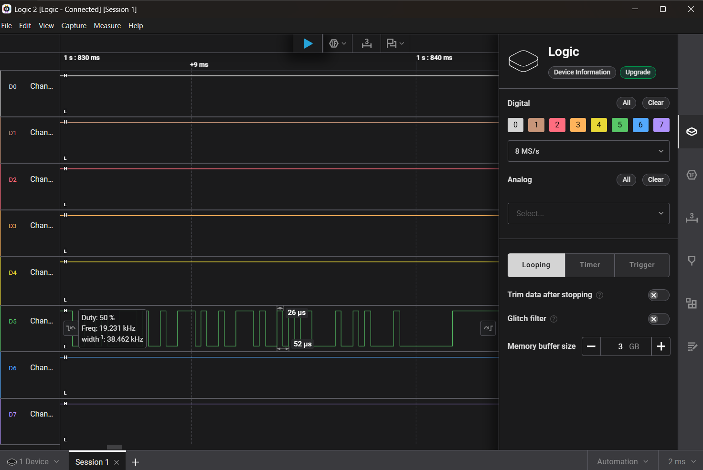

# 4. A console with no shell, and a boot loader that reads flash

The UART header is already populated on this board — four pins, no soldering.
That took the week's largest irreversible-damage risk off the table before it
started.

## Every pin has two sources

Pin identification was done twice, with the board in two different states,
because a single reading has a failure mode that looks exactly like success:

* **unpowered**, measuring resistance to ground — `GND` is the pin with
  continuity to the shield;
* **powered**, measuring voltage — `VCC` sits at 3.3 V, `TX` idles high and
  twitches at boot, `RX` idles high and does nothing.

Pin 3 was mis-identified for two days, and the reason is worth naming: it was
**inferred from the connector's usual layout rather than measured.** The
inference was reasonable and it was wrong, and nothing in the process would have
caught it, because a reasonable inference and a measurement produce the same
kind of sentence.

`VCC` is deliberately left unconnected. The adapter's ground and the board's
ground are common; the board is powered from its own supply.

## The baud rate was measured

The common approach is to try 9600, 38400, 57600, 115200 until the garbage turns
into words. That works, and it produces a number you cannot defend.

A logic analyser on the TX line during boot gives the narrowest pulse:
**26 µs**. One bit at 38400 baud is 26.04 µs. That alone is not enough — 26 µs
could be *two* bits of a 19200 stream — so the second measurement is the one
that settles it: the same capture contains a **52 µs** pulse. Two consecutive
identical bits at 38400 is 52 µs; at 19200 it would be a single bit, and the
26 µs pulse would then be *half* a bit, which does not exist.

The closest wrong answer, 19200, has a bit time of 52.08 µs. The measurement
distinguishes them.

The same analyser then decoded the boot log independently with its Async Serial
decoder, and the two transcripts — one from `picocom`, one from the analyser —
are byte-identical. That is a second instrument on the same wire, which is the
only reason the log is evidence rather than an observation.

## There is no shell

The console prints a full boot log and then a login prompt, and nothing gets
past it. `\r` echoes perfectly, which feels like something is listening — and it
is not: **that is the tty line discipline echoing, not a program.** A console
that echoes and a console with a shell behind it are indistinguishable until you
send something that requires a reply.

What the console does have is the boot loader. Streaming ESC across power-on
catches it, and it presents seventeen commands. Two of them are the whole of
chapter 5's method:

* **`FLR <dst_RAM> <src_flash> <len>`** — read flash into RAM;
* **`DB <addr> <len>`** — dump RAM as hex.

4 MiB of flash, off the device, with no chip clip and no programmer.

## Two adjacent commands, two number bases

`FLR`'s three arguments are hexadecimal. `DB`'s length argument is **decimal**.

There is nothing in the help text that says so, and the failure mode is silent:
ask for `100` bytes meaning 256 and you get 100. This cost a re-read of a region
and it is the single most useful line in this chapter for anybody repeating the
work.

The full command set, recovered from the loader's own table rather than
transcribed from the `?` output, is in
[`notes/loader-tftp-and-commands.md`](../notes/loader-tftp-and-commands.md) —
including the fact that the table's declared argument count is **read by
nothing**, and that six of the seventeen handlers dereference `argv` without
checking it.

## The wrong turns

Three, all recorded at full length in [`LOG.md`](../LOG.md):

* **A 450 °C attempt to desolder the antenna** to get a clearer photograph.
  Abandoned. It bought nothing and risked the only unit there is.
* **Cutting the power switch** to get a cleaner power cycle. Vetoed for the same
  reason: the switch works, and "cleaner" was not a measurement.
* **Pin 3**, above: two days lost to an inference that was never measured.

> **Where this chapter stops:** the baud, the pin-out and the flash read are
> measured. "There is no shell" is a statement about what this console offers at
> the login prompt on this build; it is not a claim that no code path anywhere
> in the firmware would give one — chapter 10 opens one through a different door.
