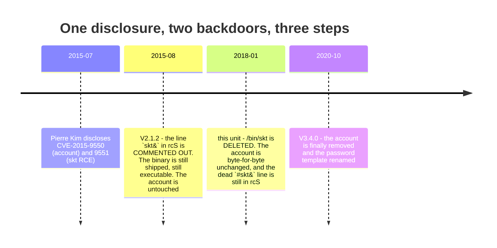

# 5. The build nobody had

This is the one result in this document that cannot be obtained by anybody who
does not own one of these routers.

## The question, unanswered for three weeks

Week 1 ended with seven questions carried forward. The first was: **which
firmware is actually on my unit?** Two images had been downloaded and read in
detail. Neither had been shown to be the one on the device, because nothing had
touched the device.

## The prediction, written before power was applied

Week 2 Day 1, with the board on the desk and unpowered, the date codes on the
ICs were read and written down: **"approximately 2018"**. That went into the log
*before* the console was attached, which is the only thing that makes it a
prediction rather than an observation.

## The reveal

The console came up at 38400 and the boot log named the build. BusyBox and
`/bin/boa` are both stamped **2018-01-10**. `/etc/version` reads:

```
TOTOLINK-CX-N150RT-V2.1.6-B20171121.1002
```

**It is a third build.** Not V2.1.2, not V3.4.0.

## The cost, stated plainly

> **The two binaries I had spent two weeks reverse engineering, this device has
> never run.**

Everything W03 and W04 established about `/bin/boa` is still true of the images
it names. None of it described this hardware. That is not a caveat; it is a
re-scoping, and it produced an entire extra week — W04-2 — whose only job was to
move the findings onto the build the device runs. Chapter 7 is what came out of
it.

## The verification

Week 1 had derived three flash burn addresses from the vendor containers'
own headers: `w6cg` at `0x010000`, `cr6c` at `0x060000`, the root filesystem at
`0x180000`. Those were derived from *published* images.

They are exactly where the corresponding regions sit in a build that nobody
outside this room has looked at. A container format read correctly out of one
image predicted the layout of another, and the second one is not downloadable.

## The payoff: a five-year fix in three steps

Pierre Kim disclosed two backdoors in July 2015 — an undocumented uid 0 account
(CVE-2015-9550) and `/bin/skt`, a socket-driven `system()` wrapper
(CVE-2015-9551). Reading the three builds against each other shows the response:



**The middle step is on no download page.** Without reading this chip, the
public record shows 2015 and 2020 and an unexplained five-year gap. With it, the
gap has a shape: the vendor removed the *binary* two and a half years before the
*account*, and kept the commented-out line that started it for all five years.

## The mistake I nearly made, and its shape

`passwd.org` — the password template — returns `No such file or directory` in
the 2020 build. The natural sentence is *"2020 removed the password template"*.

**It is renamed to `passwd_orig`.**

That is the same mistake as week 1's *"there is no `/etc/passwd` in either
image"*, which was also wrong: both images ship one. Same shape both times — **a
path test, and an inference about existence drawn from it.** A file that is not
where you looked is not a file that does not exist.

There is a sharper version of the same failure in this chapter's own material.
`/bin/skt` is gone in 2018. Stopping there gives you *"2018 fixed the 2015
backdoor"* — and that is wrong, because **the disclosure had two backdoors**.
Finding one of them fixed says nothing about the other, and the account was
still there.

**The moment you find something fixed is exactly the moment you stop looking.**

## The warning that belongs at the end of this chapter, not in an appendix

Both flash reads went through the same path: the boot loader's own `FLR`
command, over the same UART, into RAM, out through `DB`. Two reads producing an
identical SHA-256 proves the transfer and the SPI read are **stable**. It does
not prove they are **correct**. A systematic error in `FLR` is invisible to both.

The second instrument that would settle it — a SOIC-8 clip on `U19` — has been
attempted and does not work on this board yet. Chapter 14 carries it as an open
item rather than a footnote.

> **Where this chapter stops:** the three-step timeline is a comparison of file
> presence and file contents across three images. It is not a claim about the
> vendor's intent, and it is not a claim that no other N150RT unit shipped a
> different build in the same window. One unit, one dump, one read path.
