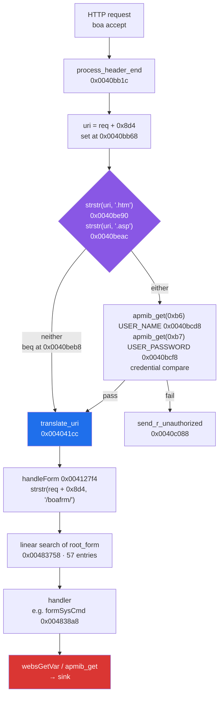

# 6. Inside `boa`: the dispatch table and the substring gate

Boa 0.94.14rc21, running as root, with the vendor's handlers bolted on. Two
structures decide everything: the table that maps a URL to a function, and the
three-line test that decides whether to ask for a password.

The whole life of a request, on this unit's build — every address read at
instruction level in
[`notes/auth-flow-2018.md`](../notes/auth-flow-2018.md), against
`sha256 19fe29d7…`, 485,012 bytes, `boa: server built Jan 10 2018`:

**The purple node is the whole defect and the blue node is why it matters.**
Authorisation is decided by two unanchored substring tests on the URI, and
*failing* them is the path that skips the check — so the arrow marked *neither*
goes straight to normal processing. Every `/boafrm/form*` URI takes it, because
none of them contains `.htm` or `.asp`.

## Recovering `root_form[]` without the leaked header

The dispatch table is an array of `{name, handler}` pairs. Leaked Realtek SDK
headers exist and say what the record looks like, and this project used one
early and got burned: the header declares `char name[80]`, and this build uses
`char *name`. A structure recovered from someone else's source tree is a
hypothesis about your binary.

So the table is recovered from **the dispatcher's own arithmetic**. The loop
that walks it advances by a fixed stride and loads two words per record; the
stride is read off the increment instruction, the record start from where the
first comparison lands, and the table's extent from where the loop's bound comes
from. [`BoaFormTable.java`](../ghidra/scripts/BoaFormTable.java) does that and
emits JSON; the result for each build carries the SHA-256 of the binary it read.

The counts, all three builds, from
[`reports/ghidra-formtable-*.json`](../reports/):

| build | table address | `root_form[]` entries |
|---|---|---|
| V2.1.2 (2015) | `0x00488720` | **59** |
| this unit (2018) | `0x00483758` | **57** — including `formSysCmd` at `0x004838a8` |
| V3.4.0 (2020) | `0x004715c0` | **49** |

`grep -aoc formSysCmd` on the three raw binaries gives **0 / 1 / 0**.

Two things in that table are worth more than the handler:

**The 2020 build dropped ten routes.** 59 → 57 → 49 is a visible narrowing of
the attack surface across five years, and it is the largest single change in the
whole comparison. It is not a fix for anything in particular; it is fewer
handlers.

**Absent → present → absent is a build-time option, not a vendor fix.** W04 had
recorded the string's absence from the published images as the vendor repairing
CVE-2019-19824; a fix does not reappear two and a half years later. That reading
is withdrawn, and the withdrawal is in the record next to the original.
**Chapter 7 narrows it further**: read across six binaries rather than three,
`formSysCmd` is still present in an N300RT build from **2019**, so the removal is
per product and not a decision taken on a date.

## The gate, and why the advisory understates it

The published advisory for CVE-2019-19822 says, in effect, *`.dat` files are not
access-controlled*. That is a symptom. The cause is broader and it is three
lines.

`process_header_end` decides whether to run the authorisation check at all, and
the test is a **substring** test on the request URI:

* **2015:** `strstr(uri, "htm")` — if the URI does not contain `htm`, no
  authorisation runs;
* **2018 (this unit):** `.htm` or `.asp`, and nothing else;
* **2020:** the 2015 test plus a POST arm.

So `/config.dat` is unauthenticated not because `.dat` is special, but because
**every path that does not contain the magic substring is unauthenticated**.
That is a much larger statement than the advisory's, and it is checkable: it
predicts which of the shipped pages are reachable without credentials, in
advance, from the code.

## The prediction it made, and the three pages nobody had looked at

Eleven exemption strings were read out of `process_header_end` at instruction
level. Five name pages this firmware does not ship. Applying the unanchored
substring test to the remaining six against the 76 `.htm` files the device
actually serves predicts **exactly seven exempt pages** — including
`wan_status.htm` and `Connect_status.htm`, which are exempt for no reason other
than that **`status.htm` is a substring of both of them**.

Measured on the device: seven exempt, sixty-nine redirected to the login page,
**no error in either direction across all 76.**

Then a bonus the prediction did not ask for: `/boafrm/formLogin.htm` answers
`404` where the other fifty-six `/boafrm/` paths answer `302`, because
`formLogin` is on the exemption list too.

## Why it is still not a bypass

The obvious next move is to decorate a blocked path until it contains an exempt
substring — `/password.htm?login`, `/login.htm/../password.htm`, and ten more
shapes. Twelve were tried. None bypassed anything.

The reason is sharper than "it did not work": **the exemption test and the file
lookup read the same normalised path.** Any path decorated enough to become
exempt is a path the server then fails to open. The two tests are wrong in the
same direction, which is what makes them consistent.

That prediction — that the substring gate implies a bypass — was written down
before the requests were sent, and it was **refuted**. It stays in the register
with the refutation recorded against it.

## Where the decompiler lost the argument

Ghidra raised three warnings on the function containing the gate. This project's
rule is that a warning costs the decompiler the last word, so the branch was
read at instruction level with
[`BoaListing.java`](../ghidra/scripts/BoaListing.java) and the note records the
instruction addresses rather than the decompiled C.

That is not decompiler-bashing. It is that a decompiler which tells you it is
unsure and is then quoted anyway has been used as an oracle rather than as a
tool.

> **Where this chapter stops:** the gate's behaviour is measured on this unit
> for `GET` against the 76 shipped `.htm` pages. The POST half of the surface is
> chapter 10's; the 2015 and 2020 readings in the table are static, from images
> this device has never run.

## How the first version of this chapter was wrong

The table above read **57 / 58 / 57**. The reports say **59 / 57 / 49**, and
this chapter names those reports — `reports/ghidra-formtable-*.json` — in the
sentence immediately above the table. It cited its own source and then disagreed
with it.

The shape of the wrong numbers is the part worth keeping: near-identical counts
with this unit one entry *above* its neighbours, which reads as *"the three
builds are much the same and mine has one extra"*. That is a comfortable
sentence and it is the opposite of what the data says. The real figures show the
2020 build shedding **ten** routes, which was the most interesting fact in the
table and was invisible for as long as the symmetry held.

Chapter 7 carried the identical wrong row, so this was not a typo — it was one
transcription reused. Found 2026-09-25, during the publication week, by chasing
a different disagreement entirely (*five builds* versus *six builds*), and the
correct values had been sitting in
[`notes/three-way-read.md`](../notes/three-way-read.md) and
[`notes/dispatch-table.md`](../notes/dispatch-table.md) since W04-2.
**Nothing in `make ci` compares a number in a chapter against the report the
chapter names**, which is open item 110 and is not fixed by this correction.
