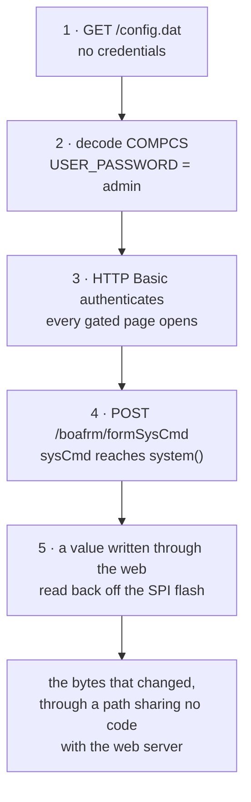

# 10. The chain: five links, five layers of evidence

Everything before this chapter is reading. This is the part where the device is
asked, on an isolated segment, with the predictions frozen and hashed before the
first packet.



## Link 1 — the file comes out with no credentials

`GET /config.dat` returns **7,490 bytes**, and its SHA-256 is **identical to
flash offset `0xC000` in the dump taken in week 2**.

That single equality does two things at once. It demonstrates CVE-2019-19822 end
to end on this hardware, and — incidentally, and this column had been empty since
week 2 — **it is a second instrument reading this flash**: the kernel's MTD
driver over Ethernet, against the boot loader's SPI routine over UART. Two paths
that share no code agreeing byte for byte.

## Link 2 — the decode

Chapter 8's parser over those bytes: `USER_NAME` and `USER_PASSWORD`, both
`admin`, both plaintext TLVs.

## Link 3 — the credentials authenticate

HTTP Basic with the decoded pair: `/password.htm` goes 302 → 200, and the
remaining 68 gated pages open.

Two predictions were **refuted** here, which is the return on writing them down.
The session model this project had read out of the disassembly does not exist:
there is no session at all, only stateless HTTP Basic — `formLogin` sets no
cookie and the device never sends `Set-Cookie`. And there is **no lockout**: 50
consecutive wrong passwords, then the correct one on attempt 51, answered 200.

There is a third arm, and it is the one nobody would have predicted: after a
successful login the device answers **that source IP address** without
credentials for **601 seconds**, re-armed by each login. Two independently
anchored boundaries, 706 seconds apart, both landing on login + 601.

## Link 4 — a parameter reaches a shell

`POST /boafrm/formSysCmd` with a `sysCmd` parameter. The path contains neither
`.htm` nor `.asp`, so the gate of chapter 6 does not run on it.

The handler's own guard is `if (*cmd != 0) { … system(buf); }`, so a POST with
**no** `sysCmd` reaches the handler and executes nothing — which is how
reachability was demonstrated separately from execution, before anything was
executed.

**The response never tells you it worked.** This is worth a paragraph of its own
because it is the part most write-ups skip.

## Blind injection, and designing an out-of-band channel

`system()`'s output goes nowhere the client can see. There is no `uid=0` in any
response body, and there never will be — looking for one is looking for
something the code cannot produce.

So the oracle has to be built:

* **the docroot oracle** — `; cat /etc/version > /var/web/probe.txt` and then
  fetch `/probe.txt`. `rcS` copies `/web/*` into the live document root, so a
  file written there is served;
* **the timing oracle** — `; sleep 5` and measure. Works with no filesystem
  write at all, and survives a read-only docroot;
* **the flash oracle** — link 5, below, which is the strongest because it does
  not go through the web server at all.

Each has a control. The docroot oracle's is that the target file **302s before
the test** — otherwise a stale file from an earlier attempt reads as a success.
That control fired once, and it is the reason this chapter can say what it says.

There is a trap in the injection itself that is worth naming: the format string
is `%s 2>&1 > %s`, so a naive payload has its output redirected into a file the
server then serves as **zero bytes**. The `;#` idiom terminates the injected
command and comments out the rest of the vendor's format string. Without it the
result is HTTP 204 and an empty file, which reads exactly like "the injection
failed".

## Link 5 — the bytes on the flash

An unauthenticated POST sets a value. The device is then power-cycled into the
boot loader, and the region is read back with `FLR` + `DB` over the serial
console.

**Nine bytes changed.** Eight are the ASCII digits of the value the client
chose; the ninth is the region's checksum, recomputed by the device.

```
$ cmp -l flash-before.bin flash-after.bin
   <the nine offsets>
```

They are also **in the wrong region**. The plan said that write lands in the
configuration block. It lands in `H601`, which holds this unit's MAC addresses
and radio calibration — measured at manufacture, present in **no vendor image**,
and **not restored by a factory reset**.

All nine were put back, and the final read is byte-identical to a dump taken
before this project had ever written to the device.

> That is the byte the HTTP request changed. Not a response, not a packet — the
> flash.

## What the chain does not include

`root:123456` is not an entry point on this unit: `TELNET_ENABLED` reads `0`,
confirmed by the code that reads it. It is the second stage of a chain that
needs link 4 first.

And the reproduction on published images only reaches link 4. `formSysCmd` is in
this unit's dispatch table and in neither downloadable build, so the L1 chain is
**not reproducible by anyone who does not already own one of these routers** —
which is a property of the disclosure, not a shortfall in the work, and it is
recorded as one.

> **Where this chapter stops:** five links, measured on one unit, on an isolated
> segment, with each prediction frozen beforehand. The 601-second window was
> measured on two boundaries and the mechanism this project first proposed for
> it was **wrong** — the instrument that reported "no write to that global" was
> the thing at fault, and chapter 12 is where that belongs.
